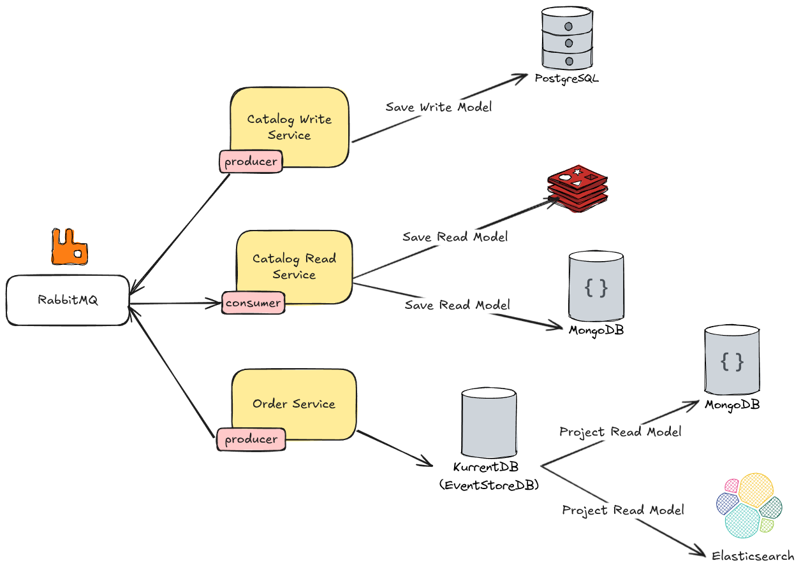
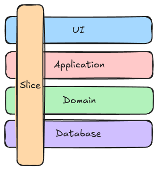

<h1 align="center">🍔 Go Food Micro 🍟</h1>

This application is primarily intended for exploring technical concepts. My goal is to experiment with different technologies, software architecture designs, and all the essential components involved in building a microservices-based application in Golang.

## Features :sparkles:

- ✅ Using `Event-Driven Architecture` built on top of RabbitMQ for asynchronous communication between services
- ✅ Using `Vertical Slice Architecture` as a high-level architecture
- ✅ Implementing the `CQRS Pattern` with separate read and write services
- ✅ Building RESTful APIs using `Echo` framework with integrated OpenAPI/Swagger documentation
- ✅ Leveraging `gRPC` for efficient internal service-to-service communication
- ✅ Using [go-playground/validator](https://github.com/go-playground/validator) and [go-ozzo/ozzo-validation](https://github.com/go-ozzo/ozzo-validation) for validating input data in the REST and gRpc
- ✅ Using `Dependency Injection` and `Inversion of Control`on top of [uber-go/fx](https://github.com/uber-go/fx) library
- ✅ Utilizing multiple databases:
  - `PostgreSQL` for write operations
  - `MongoDB` and `ElasticSearch` for read operations
  - `Redis` for caching
  - `KurrentDB/EventStoreDB` for event sourcing
- ✅ `Unit Test` for testing small units with mocking dependent classes and using [Mockery](https://github.com/vektra/mockery) for mocking dependencies
- ✅ Using `End2End Test` and `Integration Test` for testing features with all of their real dependencies using docker containers (cleanup tests) and [testcontainers-go](https://github.com/testcontainers/testcontainers-go) library
- ✅ Using `Zap` and structured logging
- ✅ Using `Viper` for configuration management
- ✅ Observability with:
  - `OpenTelemetry` for distributed tracing using `Jaeger` or `Zipkin`
  - `Prometheus` for metrics collection
  - `Grafana` for visualization
  - `Tempo` for trace storage
- ✅ Containerized deployments using `Docker` and `docker-compose`
- 🚧 Add `Kubernetes` for container orchestration and deployment
- 🚧 Using `Outbox Pattern` for all microservices for [Guaranteed Delivery](https://www.enterpriseintegrationpatterns.com/GuaranteedMessaging.html) or [At-least-once Delivery](https://www.cloudcomputingpatterns.org/at_least_once_delivery/)
- 🚧 Using `Inbox Pattern` for handling [Idempotency](https://www.cloudcomputingpatterns.org/idempotent_processor/) in reciver side and [Exactly-once Delivery](https://www.cloudcomputingpatterns.org/exactly_once_delivery/)
- 🚧 `Resiliency Patterns` for handling failures and transient errors using [go-resiliency](https://github.com/eapache/go-resiliency) for circuit breaker, retries, and backoff strategies

## Technologies - Libraries 🛠️

<h4>Core Framework</h4>

- **[labstack/echo](https://github.com/labstack/echo)** - High performance, minimalist Go web framework
- **[grpc/grpc-go](https://github.com/grpc/grpc-go)** - The Go language implementation of gRPC. HTTP/2 based RPC
- **[grpc-ecosystem/go-grpc-middleware](https://github.com/grpc-ecosystem/go-grpc-middleware)** - Golang gRPC Middlewares: interceptor chaining, auth, logging, retries and more

<h4>Database & Migration</h4>

- **[go-gorm/gorm](https://github.com/go-gorm/gorm)** - The fantastic ORM library for Golang, aims to be developer friendly
- **[mongodb/mongo-go-driver](https://github.com/mongodb/mongo-go-driver)** - The Go driver for MongoDB
- **[go-redis/redis](https://github.com/go-redis/redis)** - Type-safe Redis client for Golang
- **[EventStore/EventStore-Client-Go](https://github.com/EventStore/EventStore-Client-Go)** - Go Client for Event Store version 20 and above
- **[elastic/go-elasticsearch](https://github.com/elastic/go-elasticsearch)** - The official Go client for Elasticsearch
- **[olivere/elastic/v7](https://github.com/olivere/elastic/v7)** - Elasticsearch client for Go
- **[pressly/goose](https://github.com/pressly/goose)** - Database migration tool with support for SQL migrations
- **[golang-migrate/migrate](https://github.com/golang-migrate/migrate)** - Database migrations with support for multiple databases
- **[ariga/atlas](https://atlasgo.io/)** - Modern database schema migration tool

<h4>Validation</h4>

- **[go-playground/validator](https://github.com/go-playground/validator)** - Go Struct and Field validation, including Cross Field, Cross Struct, Map, Slice and Array diving
- **[go-ozzo/ozzo-validation](https://github.com/go-ozzo/ozzo-validation)** - Validate data of different types include, provide a rich set of validation rules right out of box

<h4>Message Broker</h4>

- **[rabbitmq/amqp091-go](https://github.com/rabbitmq/amqp091-go)** - An AMQP 0-9-1 Go client maintained by the RabbitMQ team

<h4>Logging & Error Handling</h4>

- **[uber-go/zap](https://github.com/uber-go/zap)** - Blazing fast, structured, leveled logging in Go
- **[emperror/errors](https://github.com/emperror/errors)** - Drop-in replacement for the standard library errors package and github.com/pkg/errors

<h4>Observability & Monitoring</h4>

- **[open-telemetry/opentelemetry-go](https://github.com/open-telemetry/opentelemetry-go/)** - OpenTelemetry Go API and SDK
- **[open-telemetry/opentelemetry-go-contrib](https://github.com/open-telemetry/opentelemetry-go-contrib)** - Collection of extensions for OpenTelemetry-Go
- **[prometheus/client_golang](github.com/prometheus/client_golang)** - Prometheus instrumentation library for Go applications
- **[Prometheus](https://prometheus.io/)** - Metrics collection and storage
- **[Grafana](https://grafana.com/)** - Metrics visualization and dashboards
- **[OpenTelemetry](https://opentelemetry.io/)** - Observability framework

<h4>Testing & Mocking</h4>

- **[stretchr/testify](https://github.com/stretchr/testify)** - A toolkit with common assertions and mocks that plays nicely with the standard library
- **[testcontainers/testcontainers-go](https://github.com/testcontainers/testcontainers-go)** - Testcontainers for Go is a Go package that makes it simple to create and clean up container-based dependencies for automated integration/smoke tests

<h4>Dependency Injection & Application Framework</h4>

- **[uber-go/fx](https://github.com/uber-go/fx)** - A dependency injection based application framework for Go
- **[mehdihadeli/go-mediatr](https://github.com/mehdihadeli/go-mediatr)** - Mediator pattern implementation in Golang and helpful in creating CQRS based applications

<h4>Documentation</h4>

- **[swaggo/swag](https://github.com/swaggo/swag)** - Automatically generate RESTful API documentation with Swagger 2.0 for Go

<h4>Configuration & Environment</h4>

- **[spf13/viper](https://github.com/spf13/viper)** - Go configuration with fangs
- **[caarlos0/env](https://github.com/caarlos0/env)** - A simple and zero-dependencies library to parse environment variables into structs
- **[joho/godotenv](https://github.com/joho/godotenv)** - A Go port of Ruby's dotenv library (Loads environment variables from .env files)
- **[mcuadros/go-defaults](https://github.com/mcuadros/go-defaults)** - Go structures with default values using tags

<h4>Utilities</h4>

- **[avast/retry-go](https://github.com/avast/retry-go)** - Simple golang library for retry mechanism
- **[ahmetb/go-linq](https://github.com/ahmetb/go-linq)** - .NET LINQ capabilities in Go

<h4>Deployment & DevOps</h4>

- **[Kubernetes](https://kubernetes.io/)** - Container orchestration
- **[Docker](https://www.docker.com/)** - Container platform

## Project Layout

Each microservice follows the [Standard Go Project Layout](https://github.com/golang-standards/project-layout)

## System Architecture

  
<strong>Vertical Slice Architecture</strong>

  

